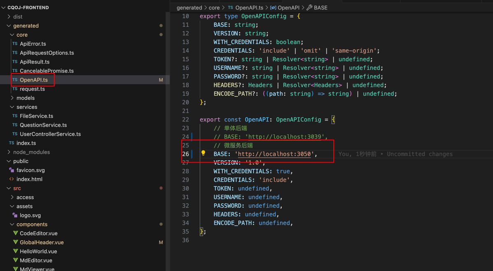

## 构建流程
### 1）代码打包构建
1.1）执行 mvn clean
```bash
mvn clean
```
1.2）执行打包构建（注意命令行版本是 jdk17）
```bash
 mvn package -DskipTests=true
```

### 2）docker compose部署
```bash
docker compose -f docker-compose.env.yml -f docker-compose.service.yml up -d
```
如果想停止服务，执行下面这个命令即可：
```bash
docker compose -f docker-compose.env.yml -f docker-compose.service.yml stop 
```

### 3）前端代码修改
只需要将地址改为图示地址即可
